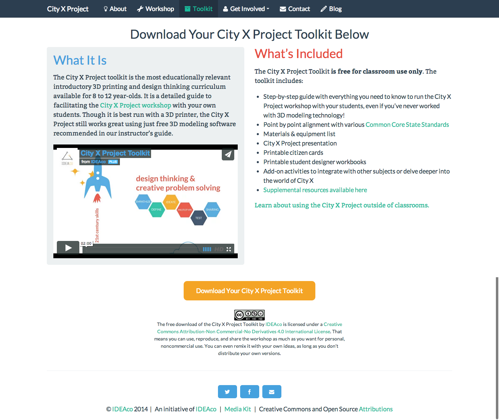

# Choosing The Right E-Commerce Platform For YOUR Needs

### Patrick Rauland - @BFTrick

###  http://speakinginbytes.com/2014/10/choosing-right-e-commerce-platform-needs/

---

## Goal #1

# Create a Framework to Pick the best E-Commerce Platform For Each Project

---

## Goal #2

# Start Simple

---

# [fit] Who Has
# [fit] E-Commerce
# [fit] Experience?

^ Who here already has e-commerce experience? What platforms have you used?

^ Have you built the site for a client or for yourself?

---

# [fit] Platforms

---

# Platforms

* Self Hosted WordPress
* Self Hosted Non WordPress
* Hosted Platform
* Hosted Payment

^ There are four types of e-commerce solutions you can use. I'm going to go into the specific solutions in just a sec but this presentation is going to be more about the types of solutions not the specific solutions.

^ Really what's most important is to pick the right category. I'll talk about specific solutions but picking the right category is the most important part.

---

# Platforms

* Self Hosted - WordPress
 * WooCommerce

^ Self Hosted WordPress solutions are plugins that you add to your own site. Running an e-commerce site on WordPress is kind of like owning a house. You can do anything you want to your house. You can add more paint the walls, add new appliances, rip out carpet, or you can completely refurbish your place.

^ the downside is that you have to mow the lawn, clean the windows, when the basement floods you have to fix it or pay someone to fix it for you.

---

# Platforms

* Self Hosted - WordPress
 * WooCommerce
 * Easy Digital Downloads

---

# Platforms

* Self Hosted - WordPress
 * WooCommerce
 * Easy Digital Downloads
 * Exchange

---

# Platforms

* Self Hosted - Non WordPress
 * Magento

^ So Magento is the only non-wordpress self hosted solution I'm listing here. It's got a lot more features built in but because of all of those extra features it's harder to use and maintain. If a self hosted WordPress site is a house then this is a mansion. It's probably has a yoga room, a ball room, one of those really long tables, and a pool which is great if you want all of those features. But if you don't need those features it's a lot of extra maintenance. That's why a lot of people who have mansions have full time helpers.

---

# Platforms

* Hosted Platform
 * Shopify

^ Hosted platforms are pretty great and I'm being serious here. I think hosted platforms are great especially for someone doing their first store and the reason is that you have less responsibility. It's kind of like leasing an apartment. If your dish washer breaks you submit a maintenance ticket and by the time you come home from work there's a note on your kitched table that they fixed it. Pretty awesome.

^ The downsides of course if that over the long term you're paying more money and you have no control over the apartment. You can't paint the walls, and you can't expand your apartment at all. You could be using the apartment for a year and then get a note that rent is doubling the follow year. Once you're settled into an apartment it sucks to move.

---

# Platforms

* Hosted Platform
 * Shopify
 * Bigcommerce

---

# Platforms

* Hosted Platform
 * Shopify
 * Bigcommerce
 * Volusion

---

# Platforms

* Hosted Payment
 * Gumroad

^ Using a hosted payment is kind of like using a tent. It's very easy to move, it's cheap, and you can set it up in 30 minutes flat.

^ The downsides are that you don't want to do this all year round. If e-commerce is you main business you don't want to be in a tent sure you can decorate your tent the way you want but it's so small. Unlike a house you can't possible add a pool.

---

# Platforms

* Hosted Payment
 * Gumroad
 * PayPal Buttons

---

# Platforms

* Hosted Payment
 * Gumroad
 * PayPal Buttons
 * E-Junkie

---

# Which of these platforms looks like a better fit?

* A platform that supports subscriptions navtively

* A platform that supports subscriptions for an upsell

^ Now at first glance who doesn't want something that's built in right? You could save your self tons of money. But when you look at the details the product with built in subscriptions might not meet your needs.

^ Gumroad for example ONLY sends out emails to subscribers. There's no way to have a special members only section on your site. They can't view the content on your site. If they want to access archived content they have to do it via Gumroad. Now for certain use cases this is exactly what you'd want but for many people this isn't what I'd call a "subscription"

---

# Feature Lists Are *Misleading*

Test, test, test business critical functionality! Or *at least* watch a YouTube video demoing that feature.

^ I find feature lists very misleading. Every single e-commerce platform I listed above is capable of selling a single product but they all do it in *very* different ways.

^ Back in Green Bay there was a great web meetup group I attended and we have a E-Commerce CMS Smackdown where we had different people present different CMS systems and then we would vote to determine the winner. I don't remember the winner but I do remember the loser. After the guy demo'd Magento I asked him a question I asked him to show us how to add a new product to the store. And he stumbled. There were errors on multiple tabs which was very confusing.

---

# Products

## What features do you *need*?

* Digital downloads?
* Subscriptions?
* Protected content?
* 20,000 products?
* Configurable products?
* Marketplace?

^ My advice here is not to look at a feature list. Think about what features you'll actually need.

^ I've lived in a lot of homes over the years and no matter how big the home is I always seem to fill it. You subconsciously think you need all of that space and you start filling it. The same can happen with software. You think you'll need all 300 features that Bigcommerce offers. But just like you don't need a big house you don't need all 300 features.

---

# [fit] Features to Look for in E-Commerce Platforms

---

## Features to Look for in E-Commerce Platforms

# A blog

^ So why do I recommend a blog as the first feature to look for a wordpress e-commerce solution? Because it can drive *so* much traffic.

---

^ Last month I had just under 10K visits to my site just talking about features in e-commerce platforms & woocommerce snippets.

---

---

* What is a furnace filter? How does it relate to other filters?
* How do I install a furnace filter?
* Can I build my own furnace filter?
* Does the quality of a furnace filter matter?
* Furnace reviews
* Recycling furnace filters
* Cleaning furnace filters
* How long do furnace filters last?

---

## Features to Look for in E-Commerce Platforms

# Newsletter functionality

---

# Newsletter functionality

* Keep your store top of mind
* Build trust
* Warm up product launches

^ if someone has bought from you one time and you offer a decent product they'll be inclined to order again from you rather than go exploring for a new vendor. So keep your your store top of mind with a newsletter.

^ warm up new product launches

^ newsletters are generally free up to 2,000 people with services like MailChimp so there's no reason not to at least repost your blog content.

---

## Features to Look for in E-Commerce Platforms

# Intelligent recommendations

^ Now before I get onto intelligent recommendations you definitely need recommendations. So you can manually add recommended products on the product page.

^ Does anyone know what the two most commonly items that are purchased together?

^ Diapers and beer

^ Does anyone here know what percentage of the amazon home page is personalized?

^ 70% of the homepage is personalized recommendations for you based on your purchasing habits and users like you.

^ 75% of Netflix' business is done through recommendations

^ Amazon's Kindle business is 50%

^ Amazon's buisness is 35%

---

^ I can't say the exact numbers but we've have a pretty big uptake in sales due to these automated recommendations

^ And they have a free account

---

## Features to Look for in E-Commerce Platforms

# Advanced Reports

* # orders, products, coupons, etc.
* Google Analytics
* User behavior (ex. KissMetrics & MixPanel)
* Cost of goods

^ Google analytics is great because you can look at your visitors and see what behavior converts the most

^ User behavior is great for subscriptions. See how long people are a subscriber. What's the pattern? After how many articles do they cancel? Do they cancel after 6 months?

^ Cost of goods is important to see if after all of your discounts if you still make money.

---

## Features to Look for in E-Commerce Platforms

# Customizable shipping

^ one of the things that everyone wants custom is shipping rates.

^ one person wants to pack two of every item into a box. Another wants to get live USPS quotes, another wants to charge $10 per order + $2 per item, and someone else wants to unlock free shipping after $100

^ What's best here is simple options by default and then options to make it more customizable. One of my first woocommerce sites was a furniture website and it took them about 2 years to launch.

---

## Features to Look for in E-Commerce Platforms

# Customizable shipping

* Flat rate shipping
* Free shipping (unlockable)
* Live rates (UPS, USPS, FedEx)
* Table rate shipping

---

# [fit] Easy Wins

^ Several e-commerce solutions are really great at one or two things. I'm going to list those here

---

## Easy Win - Selling an E-Book

# Gumroad

^ Gumroad is awesome at selling e-books, images, powerpoints, or whatever.

^ Let me show you what a friend of mine did.

^ There is no support for affiliates.

---

---

---

---

---

---

## Easy Win - Enterprise Clothing Store

# Magento

^ When you have an IT department it's quite nice that a lot of the functionality is built in.

---

## Easy Win - Non-tech Savvy Store Owner

# Shopify

^ If you peck at the keyboard or the way you access the internet is by clicking on the big blue E you may want to look at a hosted solution like Shopify

---

## Easy Win - Store Owner That Can Install WordPress

# WooCommerce / EDD / Exchange

^ You can customize these in any way you want. You can find a new theme and slap it in. With WC you have access 100+ payment gateways.

^ When the basement floods you have to call someone to fix it.

---

# SellWithWP.com

WordPress specific e-commerce tutorials, reviews, & articles.

---

# WooCommerce Conf

Right after WordCamp San Francisco we're having our first ever WooConf. If you want to know more about e-commerce from people who have been in the industry a decade please stop by.

---

## Patrick Rauland - *@BFTrick*
### WooThemes

^ So that's me. I work for WooThemes and we make WooCommerce.

^ We're always hiring

^ Also I'm writing a book about e-commerce so if you're just getting started please come up to me after the presentation and let me know what you liked about this presentation and what questions you still have.
